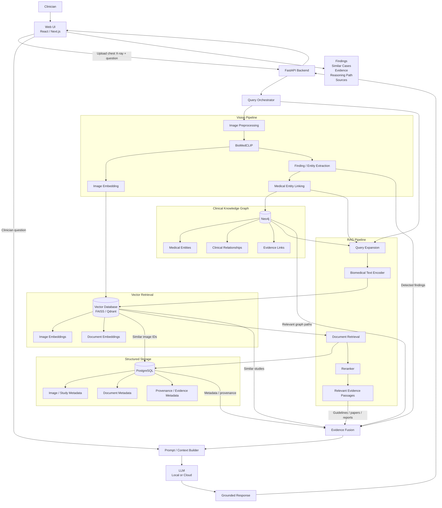

##      Clinivue

### Objective

Given a visual and/or textual query, retrieve relevant visual entities and related information from multimodal data sources, reason over explicit relationships between those entities, and return an interpretable natural-language result grounded in traceable evidence.


### Example Usage

Suppose a **Medical Proffesional** uploads a chest-Xray and asks, "what findings are present,
what prior cases are visually similar, and what supporting literature or guidelines are relevant?"

The flow would be:

```
Chest X-ray + clinician question
        ↓
Vision model
        ↓
Detected findings / regions
        ↓
Visual retrieval of similar studies
        ↓
Medical entity linking
        ↓
Clinical knowledge graph
        ↓
Guideline / paper / report retrieval
        ↓
Evidence-grounded LLM synthesis
        ↓
Findings + similar cases + supporting evidence
```

### System Design



### Functional Requirements 

FR-1: Medical image ingestion

The system shall allow a user to upload a supported medical image

FR-2:

FR-3:

FR-4:

FR-5:

FR-6:

FR-7:

FR-8:

### Tools:

Python, Postgresql, FastAPI, Neo4j, pytorch, torchvision, FAISS, BioMedClip, pydantic, PyMuPDF, 


