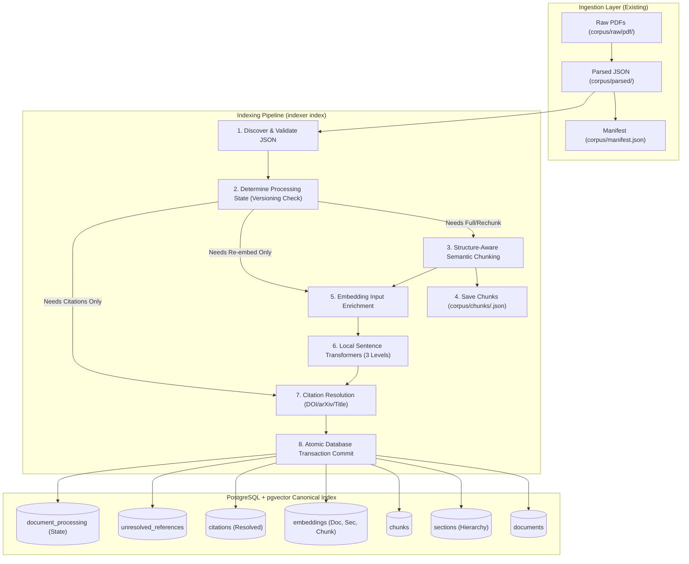
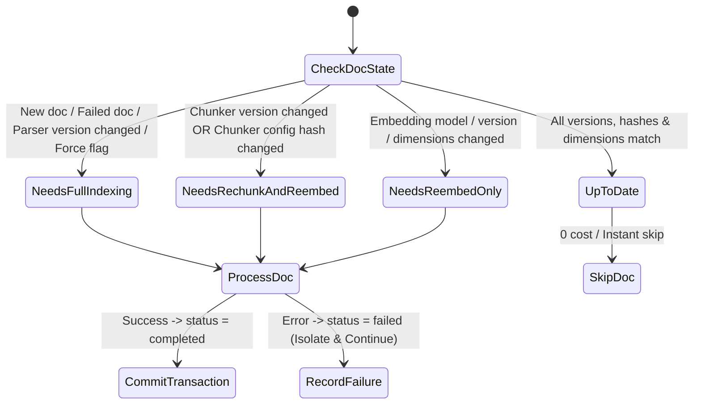

# Indexing Layer: Architecture & Implementation Report

This report documents the design, architecture, and verification of the **Indexing Layer** for the Research Intelligence System. The indexing layer transforms parsed academic paper JSON artifacts from the ingestion layer into a versioned, hierarchical, queryable index in **PostgreSQL + pgvector**, generating reproducible filesystem chunk artifacts in `corpus/chunks/`.

---

## 1. System Architecture



---

## 2. Directory & Storage Contract

The corpus structure maintains strict separation between source data, parsed representation, chunk artifacts, and vector index:

```
corpus/
├── raw/
│   └── pdf/
│       ├── doc_001.pdf
│       └── ...
├── parsed/
│   ├── doc_001.json
│   └── ...
├── chunks/
│   ├── doc_001.json
│   └── ...
└── manifest.json
```

> [!NOTE]
> **No Embeddings Directory on Disk:** Embeddings are vector indexes stored directly in PostgreSQL with `pgvector`. `corpus/chunks/` contains reproducible JSON artifacts with source text and structural context without raw embedding floats.

---

## 3. Database Schema (PostgreSQL + pgvector)

The relational schema strictly enforces foreign keys, hierarchy, and metadata integrity.

### Tables Overview

| Table | Primary Key | Foreign Keys | Key Columns | Purpose |
| :--- | :--- | :--- | :--- | :--- |
| `documents` | `id` | - | `content_hash`, `title`, `abstract`, `doi`, `arxiv_id`, `publication_year`, `venue`, `page_count`, `parser_version` | Primary document entity (1 PDF = 1 Doc). |
| `sections` | `id` | `document_id` $\to$ `documents`, `parent_section_id` $\to$ `sections` | `title`, `level`, `page_start`, `page_end`, `section_order` | Preserves full section/subsection tree. |
| `chunks` | `id` | `document_id` $\to$ `documents`, `section_id` $\to$ `sections` | `chunk_index`, `source_text`, `embedding_text`, `page_start`, `page_end`, `token_count`, `chunker_version`, `chunker_config_hash` | Semantic chunks belonging to exactly one section. |
| `embeddings` | `id` | `document_id` $\to$ `documents`, `section_id` $\to$ `sections`, `chunk_id` $\to$ `chunks` | `level` (`'document'`, `'section'`, `'chunk'`), `model_name`, `model_version`, `dimensions`, `embedding` (`vector`) | Multi-level retrieval vectors. |
| `citations` | `id` | `source_document_id` $\to$ `documents`, `target_document_id` $\to$ `documents` | `reference_id`, `raw_text`, `doi`, `arxiv_id`, `resolution_method`, `resolution_confidence` | Resolved intra-corpus citation relationships. |
| `unresolved_references` | `id` | `source_document_id` $\to$ `documents` | `reference_id`, `raw_text`, `doi`, `arxiv_id`, `title`, `authors`, `year` | Unmatched bibliography entries (no placeholder docs). |
| `document_processing` | `document_id` | `document_id` $\to$ `documents` | `parser_version`, `chunker_version`, `chunker_config_hash`, `embedding_model`, `embedding_model_version`, `embedding_dimensions`, `status`, `last_indexed_at`, `error_message` | Invalidation and incremental processing state. |

---

## 4. Chunking & Enrichment Specification

### Structure-Aware Semantic Chunking Rules
1. **Section Isolation:** Every chunk belongs to exactly one section. Chunks never cross section or subsection boundaries.
2. **Short Section Guarantee:** Short sections (e.g. `5 Conclusion` with 40 tokens) produce at least one chunk.
3. **Paragraph Accumulation:** Paragraphs are processed in source order until `target_tokens` (default: 512) is reached.
4. **Sentence Splitting & Token Fallback:**
   - Paragraphs exceeding `target_tokens` are split on sentence boundaries (`(?<=[.!?])\s+`).
   - Oversized sentences that exceed `target_tokens` on their own fall back to deterministic token-based slicing with token overlap.
5. **Within-Section Overlap:** Overlap tokens (default: 64) are taken from the trailing units of the previous chunk in the same section.
6. **Deterministic Chunk IDs:** `chunk_{document_id}_{chunk_index:04d}`.

### Multi-Level Embedding Input Enrichment

Source text is never modified. The enrichment engine constructs dedicated embedding inputs:

- **Chunk Level:**
  ```text
  Document: ViTGAN: Generative Adversarial Networks with Vision Transformers
  Section: 3 ViTGAN
  Subsection: 3.1 Discriminator

  <Chunk Source Text>
  ```
- **Section Level:**
  ```text
  Document: ViTGAN: Generative Adversarial Networks with Vision Transformers
  Section: 3 ViTGAN > 3.1 Discriminator

  <Section Body Text>
  ```
- **Document Level:**
  ```text
  Document: ViTGAN: Generative Adversarial Networks with Vision Transformers
  Abstract:
  We introduce ViTGAN, a purely transformer-based generative adversarial network...
  Sections:
  - Abstract
  - 1 Introduction
  - 2 Related Work
  - 3 ViTGAN
  - 4 Experiments
  - 5 Conclusion
  ```

---

## 5. Incremental Indexing & Version Invalidation State Machine

The indexer evaluates each document's state against the `document_processing` table:



---

## 6. Citation Resolution Engine

- **Scope:** Intra-corpus resolution only (no external scholarly APIs or LLM inferences).
- **Matching Priority:**
  1. `DOI` normalized exact match (1.0 confidence).
  2. `arXiv ID` normalized match (1.0 confidence).
  3. `Normalized Title` (alphanumeric, case-folded, minimum 3 words, 0.9 confidence).
- Unresolved references are preserved in `unresolved_references` with their raw citation text and extracted metadata without polluting `documents`.

---

## 7. CLI & Operational Usage

The primary CLI interface is registered as `indexer`:

```bash
# Index corpus directory (default model: BAAI/bge-base-en-v1.5)
indexer index ingestion/corpus/

# Force re-indexing of all documents
indexer index ingestion/corpus/ --force

# Custom database connection and model
indexer index ingestion/corpus/ --db-url "postgresql://localhost:5432/research_intel" --model "BAAI/bge-base-en-v1.5" --batch-size 32

# View index statistics
indexer status
```

---

## 8. Verification & Test Results

The implementation was tested against unit tests, integration tests, and live execution on the `papers/` corpus.

### Unit & Integration Test Suite (21/21 Passing)
- `tests/chunking/test_structural_chunking.py` (7 tests: boundary preservation, sentence splitting, short sections, overlap, determinism, config hash, non-mutating enrichment)
- `tests/embeddings/test_embeddings.py` (3 tests: dimension verification, enrichment templates, live model inference)
- `tests/citations/test_citations.py` (2 tests: normalization, DOI/arXiv/title resolution)
- `tests/database/test_database.py` (2 tests: schema init, atomic transaction rollback & failure isolation)
- `tests/pipeline/test_incremental_indexing.py` (1 test: state transition matrix)
- `tests/integration/test_indexer_integration.py` (1 test: full end-to-end indexing, chunk file verification, idempotent re-run)
- `ingestion/tests/test_pipeline.py` (5 tests: ingestion structure verification)

### Live Execution Summary
```
$ indexer index ingestion/corpus/
=== Indexing Summary ===
Documents discovered: 3
Successfully indexed: 3
Skipped (up to date): 0
Failed: 0
Completed in 4.75s

$ indexer index ingestion/corpus/
=== Indexing Summary ===
Documents discovered: 3
Successfully indexed: 0
Skipped (up to date): 3
Failed: 0
Completed in 0.04s
```
